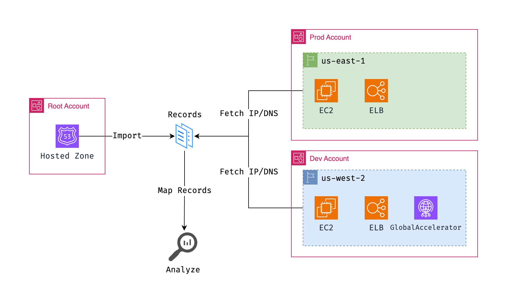

# AWS Stale DNS Finder



## Description

AWS Stale DNS Finder is a tool designed to identify and manage stale DNS records within your AWS environment. It helps you keep your DNS records clean and up-to-date, preventing issues related to outdated or unnecessary DNS entries.

## Supported Adapters

- [x] ec2
- [x] elbv2
- [x] globalaccelerator
- [x] lightsail
- [ ] cloudfront
- [ ] elasticbeanstalk

## Demo Run

```
$ python3 app.py import-dns
Importing records from /hostedzone/ZYXABC0123456789
Processing records from /hostedzone/ZYXABC0123456789
Done

$ python3 app.py fetch-all 
Creating boto3 sessions
Loading adapter ec2
Loading adapter elbv2
Loading adapter globalaccelerator
Loading adapter lightsail

$ python3 app.py analyze 
record                    type               region     name
------------------------  -----------------  ---------  ---------------
mdminhazulhaque.io.       loadbalancer       us-east-2  prod-web-lb
demo.mdminhazulhaque.io.  instance           us-west-1  i-5a6b7c8d1100
api.mdminhazulhaque.io.   instance           us-west-2  i-5a6b7c8d1100
bob.mdminhazulhaque.io.   lightsail          us-west-1  bitnami-server
alice.mdminhazulhaque.io. instance           us-west-2  i-5a6b7c8d1100
foo.mdminhazulhaque.io.   instance           us-west-1  i-5a6b7c8d1100
bar.mdminhazulhaque.io.   globalaccelerator  us-west-2  prod-api-ga
baz.mdminhazulhaque.io.   loadbalancer       us-west-2  lb-baz

```

## Features

1. **Scan**: Scans your AWS environment for stale DNS records.
2. **Report**: Generates a comprehensive report detailing all identified stale DNS records.
3. **Clean**: Offers an option to clean up the stale DNS records, either manually or automatically.

## Prerequisites

- AWS Accounts
- AWS CLI installed and configured
- Python 3.x
- Boto3 Python library
- Click Python library

## Installation

1. Clone this repository to your local machine.
2. Navigate to the cloned directory.
3. Install the necessary Python packages using the command: `pip3 install -r requirements.txt`

## Workflow

| Steps| Command |
|-----------------------------------------------|------------------------------------|
| :file_folder: Create a valid config file named `config.ini` | `cp config.example.ini config.ini` |
| :arrow_down: Import DNS records from Hosted Zone | `python3 app.py import-dns` |
| :arrows_counterclockwise: Fetch Resources from All Accounts | `python3 app.py fetch-all` |
| :mag_right: Prepare Report | `python3 app.py analyze` |
| :warning: Clear Cached Data | `python3 app.py clear` |

## TODO

- [ ] Add more adapters that produces IPv4/IPv6
- [ ] Improve code quality and file caching
- [ ] DualStack IP Handling for resources

## Contributing

We welcome contributions to the AWS Stale DNS Finder. Please feel free to submit pull requests or open issues to improve the tool.

## License

AWS Stale DNS Finder is released under the MIT License. See the LICENSE file for more details.
